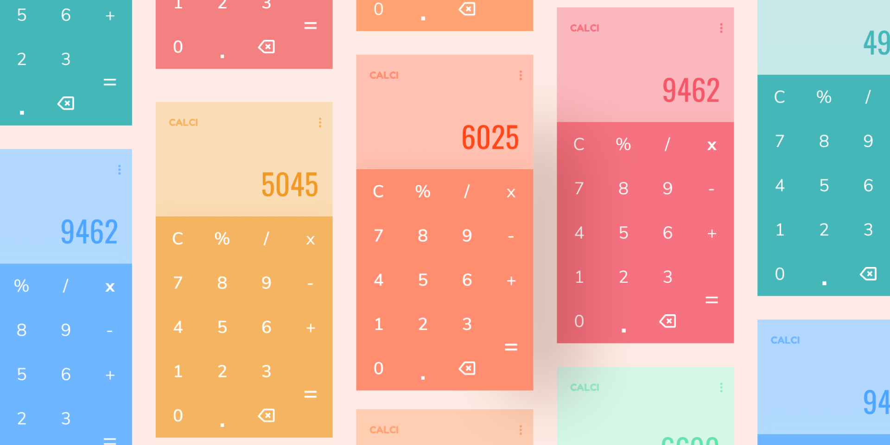

# Calci
Calculadora responsiva e personalizável

## ✨ Tecnologias
HTML | CSS | JavaScript | Google Fonts

## 🔖 Layout
Você pode visualizar o layout do projeto através [desse link](https://www.figma.com/file/AvPdOM7aXymnvGFH2SfioL/Colorful-Calculators-(Community)?node-id=101%3A2).

  <small>Desenvolvido por Vitório Gomes - Junho/2022</small>  

